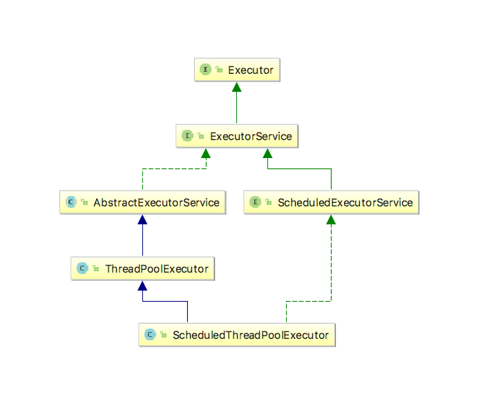

<h1>5.1</h1>

1.想法
<ul>最近几天各种杂事，没有真正静下心学习，但是也思考了很多另外的东西，列一下</ul>

	1.笔记上写的东西越来越多，但是好多记下又忘了，一定要定期复习!!!
	2.面试的准备，很多要现在开始准备了，打有准备的仗（本地单开一帖）
	3.面经要看，在收藏里头
	4.优秀的人太多，需要追赶的人也太多，我还有自己的一些小小的私心，想要有所成就去找她，不能这样随便的放弃

2.小疑问
<ul>1.他们平时mongo数据都是怎么导出的？？？</ul>

<h1>5.2</h1>

1.类加载机制和类加载器
<ul>1.类加载机制：加载，验证，解析，准备，初始化</ul>

	准备阶段，给类变量（static变量）赋值，0或null
	初始化阶段，先静态，再普通，最后构造

<ul>2.类加载器</ul>

	Java中类加载分两种，1.自带的装载，也就是new，2.手动装载，就是Class.forname()这种的，多用于反射

	而java在虚拟机启动时，会自动装载程序运行的基础类，另外的在用到时才会装载，这样就节约了内存，也算是动态性的体现。

	###类加载器具体分类（自顶向下）
	1.bootstrap loader：这是启动时的类加载器，并不是java写成的，是C++，负责加载JRE/lib/里面的class，和-Xbootclasspath参数指定的路径里的类（并且要符合命名规范，比如rt.jar ，否则放在lib里，也不会加载）

	2.Extension loader:扩展的类加载器，负责加载JRE/lib/ext里的class，和java.ext.dirs系统变量指定的路径中类库

	3.application loader:应用级（系统级）类加载器，负责加载classpath下的类和jar，通常ClassLoader 的 getSystemClassLoader()返回的就是这个

	4.自定义类加载器：继承java.lang.ClassLoader，并重写父类的findClass方法，例如tomcat之类的容器都有自己类加载器，而且不太一样，优先加载自己的，没有再去向上委托

	###双亲委托机制
	需要加载一个类时，先是下面的类加载器拿到，然后委托给父加载器，父加载器不能加载，才下放，这样就保证了比如 Object这种顶层类不会加载错误，即使你下面重写了一个自己的Object类，也不会被加载，因为该类早在启动时就加载好了

	注意有一点，虽然Ext的父加载器是null，所以打印时，显示Null，因为bootstrap是C++实现的，java虚拟机没有相应的class类，但是当向上委托时发现父类加载是空，就会用启动类加载器，道理是一样的
	
<ul>3.反射</ul>

	###反射常见的有两种api
	Class.forName(Name)  //默认初始化
	ClassLoader.loadclass(className)  //默认不链接

	像JDBC用的就是Class.forName() ,因为DriverManager注册等的代码，都是写在static块中，需要初始化
	
<ul>4.补充</ul>

	事实上，jvm判断两个类是否相等，用的类加载器，所以，即使是同一个类或者同一份代码，用不同类加载器加载，也是不同的class对象，equals也是不一样的

<h1>5.3</h1>

1.想做
<ul>1.查看每个类的重写的equals方法，和hashcode()</ul>

2.八种基础数据类型
<ul>1.哪8种：</ul>

	###四种整数类型
	byte(8位)  -2^7~2^7,
	int(32位),
	long(64位),像这种，就要在数字后面加 L 
	short(16位)

	###两种浮点数类型
	float(32位)，加 F 或 f
	double(64位),加 D 或 d
	浮点数是不精确的，不能做精确比较

	###一种字符类型和布尔类型
	char(16位)
	boolean

<h1>5.4</h1>
**1.String常量池**
<ul>1.jvm相关概念回顾</ul>

	###JDK7
	方法区存：类信息，常量池，静态变量
	所以String常量池也在里面

	###JDL8
	把常量池，还有静态变量都迁到了堆上，作为其中的一块区域

	###
	Integer、Byte、Short、Long、Character、Boolean等类型实现了常量池

<ul>2.String常量池作用：1.减少相同字符串频繁创建的消耗，而且像一种缓存，提高性能  2.在某些字面量拼接时，效率会更高</ul>

<ul>3.不同的创建字符串的方式</ul>

	### 
	String str2 = new String("abc");

	上面的语句发生了什么？？创建了两个对象，和一个引用。
	1.首先查询常量池是否有"abc",发现没有，就在常量池创建"abc"的对象，然后在堆上创建一个String对象，引用前面的"abc"，最后用 str2 引用

	###
	String str2 = "aaaa";
	
	这句就是只在常量池创建一个对象，而如果是 String str2="abc"，这样就不用创建对象，因为原来的常量池里面已经有了。

	###
	再总结下，字面量的拼接，直接存结果，而运行期才知道的变量，是会存在堆上的。而final修饰的变量，编译时期就弄好了。

	每个new String对象都是不一样的，而字面量的拼接，只会存结果

	### intern()
	这个方法，把字符串注册进常量池中，看起来有点多余，明明new String也会加进常量池，但是new String返回的对象在堆上，而interb返回的对象，就是在常量池上

**2.String类型不可变**
<ul>1.String是引用类型</ul>
	
	首先，String不是基本数据类型，是引用类型，是存放在堆上的，而且因为是不可变的，所以每次更改，比如 += 都是重新拷贝一份，对原来的不改变，这也就导致字符串这种，用完即扔，等待垃圾回收

<ul>2.String的不可变怎么实现的</ul>

	jdk8源码
	public final class String implements Serializable, Comparable<String>, CharSequence {
	    private final char[] value;
	    private int hash;

	###
	String本质是char数组，这里用的final其实是保证引用不变，但是数组里面的元素还是可以变的，但是被封装死了，没有setFValue的方法，而且是private，所以不可变了

	###注意
	final关键字不仅不可变，而且不可被继承

<ul>3.String为什么要不可变</ul>

	1.为了保证String常量池可以实现。可以变来变去，常量池就没有意义
	2.多线程安全，可以多出共享
	3.计算hashcode的时候，因为不可变，所以不会变来变去，计算一次就行了，很方便，所以比如map的key就是用的String
	4.类加载的安全性，因为类加载要用到字符串，不可变才能保证JVM安全

<h1>5.5</h1>

1.杂，疑问
<ul>1.hbase??</ul>
<ul>2.回去面经的加上，线程池的使用，就在那个hl_node里面，还有那个webmagic的架构咋样</ul>

<h1>5.6</h1>

**1.JVM回顾**
<ul>1.每一个方法都会创建一个栈，都有自己的局部变量表等，栈深超出设定，报错栈溢出StackOverflowError，内存不够就报超出内存，OOM</ul>
<ul>2.虚拟机栈</ul>

	1.局部变量表
	2.操作数栈，大致和局部变量表一样，但是这是用来做数的处理的，比如加减之类的
	3.方法返回地址
	4.动态引用（不管）

**2.java的多态（重载和覆盖）**	
<ul>重载</ul>

	重载简单来看，就是同一个方法，不同的参数，使用的时候根据不同的参数，调用不同的方法

	###
	重载是java静态分派的经典实现。
	比如 Person p = new student();  传入foo()方法里，是调用Person类型的重载？还是student类型的重载？这里Person是静态类型，student是实际类型，静态分派中，需要在编译时期就确定下来，所以重载是用静态类型确定的，这里调用person的重载

	###疑问？
	重载只能发生在同一个类里吗？父子间的重载可以吗？
		public class A
		{
		    public void a(int x){}
		}
		
		public class B extends A
		{
		    public void a(Object x){}
		}
	
	一种说法，两个a方法既不是重载，也不是重写，完全没关系，另一种说法，算是重载，因为子类相当于也继承了A的a方法
	
	
<ul>重写 @Override可有可无</ul>

	重写发生在父子类中，继承的时候只可以继承public和portected，所以private没有重写的可能，重写的时候，访问权限可以改，但只能更大，返回要一样

	###
	相比重载的静态分派，重写是动态分派的一种，就是根据实际类型来选择调用的

<ul>区别</ul>

	重载对返回没要求，而重写访问权限要么不变要么更大，返回要一样，而且不能声明更多异常
<ul>静态分派(重载)和动态分派(重写和其他)</ul>

**3.父类作为句柄声明子类**
<ul>注意点</ul>

	###
	父类声明子类，所以是父类的句柄指向子类的对象空间
	1.只能通过父类访问父类有的属性（也就是对子类而言，只能访问到子类继承过来的东西），如果父类某方法是private，不能被继承，就会调用父类的方法
	2.子类中重写了方法，用父类声明的时候，就会调用子类的方法，要重写哦
	3.子类调用super的父类的相应方法，父类再调用被子类重写过的，就会调的是子类的方法

<h1>5.7</h1>

**1.杂**
<ul>1.计算机最小单位是位(bit，比特)，然后是1字节(8bit)，字节也叫做byte,B</ul>、
<ul>2.java魔法数字:魔法数字本质上就是代码中出现的数字，但是为了代码一目了然，最好使用常量或者枚举</ul>

**2.贪心算法**
<ul>1.分发糖果：对孩子和糖果都排序，用每一个糖果去满足符合要求的最小孩子</ul>
<ul>2.跳跃游戏55：</ul>

	我先是提出一种递归想法，但是时间超出，改用循环
	循环有两种for 和 while ，这里用的是while
	###
	保存一个最远值，index不断向后，while(index<max)，当最远的能达到目标就return
	
<ul>3.跳跃游戏升级45</ul>

	这次要求不一样，假设一定能到最后一个点，要求的是最小的跳跃次数

	###动态规划
	创建伴生数组，全设为最大，第一个为0，并设置一个最远的距离，初始0，遍历，当跳跃距离大于最远，就更新，次数+1

	###总结
	动态规划，一个模板走天下，要么递归，要么用数组
<ul>4.活动选择：每个活动都有自己的开始时间和结束时间，可能会互相冲突，要求一段时间里，能做的最多的活动</ul>

	###动态规划
	假设是 i 到 j 这段时间，里面有个k活动 ，那个最大 c[i,j]=c[i,k]+1+c[k,j]，但是k 不知道是哪个，所以要遍历，子问题的终止条件是，开始时间和结束时间相等或大于

	###贪心算法
	每次都找最早结束的，或者最晚开始的

<h1>5.8</h1>

1.杂
<ul>1.IO密集型和cpu密集型忘了</ul>
<ul>2.mongo的导入和导出</ul>

	mongodump -h 172.16.5.191:17017 -d securityEvent -c hidelink.blankkeyword -o D:/MongoDB/dump

	mongorestore -h 127.0.0.1:27017 -d securityEvent -c hidelink.blankkeyword D:/MongoDB/dump/securityEvent/hidelink.blankkeyword.bson
<ul>3.java 队列（线程安全）？？？concurrentlinkedqueue使用场景？？</ul>
<ul>4.webmagic</ul>
<ul>5.springcloud</ul>
<ul>6.es爬虫？</ul>
<ul>7.web高并发？抢票？？</ul>
<ul>8.https://www.cnblogs.com/Jansens520/p/8624708.html</ul>
<ul>9.https://yuzhouwan.com/posts/190413/</ul>

3.@Value的注入在什么阶段？？比类初始化早吗

<h1>5.9</h1>

**1.杂**
<ul>1.同时把多个字符串replace成"":</ul>

	String src = "南京市玄武区北京东路徐州市鼓楼区戏马台";   
    src = src.replaceAll("(?:江苏省|玄武区|鼓楼区)", "");  

<ul>2.IDEA快速定位到报错处 ：F2</ul>
<ul>3.concurrent包</ul>

线程池源码中，自带有任务队列，但这个队列是给任务准备的，也就是说，排队的是Runnable

**2.线程池**
<ul>1.为什么要用到线程池：1.不需要关心对线程的创建销毁，使用完后自动放回池子。  2.实现了对线程的复用，不用频繁创建销毁，节约成本</ul>
<ul>2.相关类的描述</ul>

	###Executor
	这个接口内容很少，且只有一个方法，execute(Runnable r)，作为一个最基本的单元

	###ExecutorService
	拓展了Executor的功能
	
	###ScheduledExecutorService
	继承了ExecutorService，增加了调度功能

	###Executors
	这是个类，唯一的作用就是创建线程池，创建不同的线程池

	###图中另外两个类，就是具体实现了，最主要是ThreadPoolExecutor

**3.ThreadPoolExecutor源码分析**

	private final BlockingQueue<Runnable> workQueue;  // 任务队列，我们的任务会添加到该队列里面，线程将从该队列获取任务来执行
	private final HashSet<Worker> workers = new HashSet<Worker>();//任务的执行值集合，来消费workQueue里面的任务
	private volatile ThreadFactory threadFactory;//线程工厂
	private volatile RejectedExecutionHandler handler;//拒绝策略，默认会抛出异异常，还要其他几种拒绝策略
	private volatile int corePoolSize;//最下保活work数量
	private volatile int maximumPoolSize;//work上限
	private long keepAliveTime //非核心线程的闲置时间

	###当exxcutorService进行submit时，会往上调用，在ThreadPoolExecutor中，corePoolSize是设置的阈值，maximumPoolSize线程池大小，若执行线程数量<corePoolSize就创建并执行

<h1>5.10</h1>

**1.杂**
<ul>1.线程池报错NullPointerException，这个是在使用execute()的时候才有的，换成submit就Ok</ul>
<ul></ul>
<ul></ul>

**2.线程池工作流程**

	1.首先执行submit或者execute，终究会走到ThreadPoolExecutor的excute()，这时候判断正在执行的线程个数是否小于核心线程数，小于就啥事没有，添加worker，并传进任务参数（addWorker方法传参，本身并不加进队列，直接执行），执行就好了

	2.大于等于核心线程数，走下一步，判断池子是否活着，并把任务加进队列，如果都OK，在检查一遍池子活着吗，死的就删除队列中的该任务，并拒绝，活着在检查下，执行的worker是不是为0，是的话，就加一个空的worker（这里不管咋样，都已经加进了队列，总会被worker消费的）

	3.第二步骤中，判断池子活着并加队列的操作，如果失败，就到了这里，这里会尝试使用maximumPoolSize来addWorker，如果再失败，就拒绝（注意哦，这里创建的就是非核心worker，会有keepAliveTime的限制时间）

3.线程池静态工厂
<ul>1.底层实际执行的方法</ul>

	public ThreadPoolExecutor(int corePoolSize,
                              int maximumPoolSize,
                              long keepAliveTime,
                              TimeUnit unit,
                              BlockingQueue<Runnable> workQueue)

<ul>2.newSingleThreadExecutor:单线程的线程池，保证是按照先进先出的顺序执行，而且在一个线程异常结束后，会创建一个新线程顶上，但是并不是想象中的继续上一个线程的工作，而是执行下一个任务</ul>

	new ThreadPoolExecutor(1, 1,
                       0L, TimeUnit.MILLISECONDS,
                       new LinkedBlockingQueue<Runnable>(),
                       threadFactory)

	##用的是无界队列

<ul>3.newFixedThreadPool：</ul>
	
	new ThreadPoolExecutor(nThreads, nThreads,
                           0L, TimeUnit.MILLISECONDS,
                           new LinkedBlockingQueue<Runnable>());

	这里可以看到，corePoolSize和maximumPoolSize都是设的一样的，而且keepAliveTime=0，说明根本不需要规定核心线程数这种东西，完全是定长，因此，用的也是无界队列LinkedBlockingQueue

<ul>4.newCachedThreadPool:无界线程池，可回收线程，空闲60s即回收</ul>

	new ThreadPoolExecutor(0, Integer.MAX_VALUE,
                      60L, TimeUnit.SECONDS,
                      new SynchronousQueue<Runnable>()

	###
	看参数可知，该线程池根本没有worker数量的限制，也就是不限制线程数量，完全按照机器性能来，而且这里不用无界队列了，用的是SynchronousQueue，这个想要添加，必须先取出一个，刚好适合直接提交的策略

<ul>5.newScheduledThreadPool:支持周期任务</ul>
<ul>6.线程池之间的区别：</ul>

	
<ul></ul>

<h1></h1>
<ul></ul>
<ul></ul>
<ul></ul>
<ul></ul>
<ul></ul>
<ul></ul>
<ul></ul>
<ul></ul>
<ul></ul>

$and:[{"reliability":1},{"isValidate":1}]